# Mid Project - Proyecto de Análisis Inmobiliario

### Descripción del proyecto
Este proyecto tiene como objetivo construir un modelo de aprendizaje automático para predecir los precios de venta de casas basado en una variedad de características que influyen en el valor de la propiedad.

### Dataset
El dataset utilizado en este análisis contiene información de 22,000 propiedades vendidas entre mayo de 2014 y mayo de 2015. Incluye las siguientes variables:

* Id: Número de identificación único para la propiedad.
* date: Fecha en la que se vendió la casa.
* price: Precio de venta de la casa.
* waterfront: Indica si la casa tiene vista al agua.
* condition: Calidad general de la propiedad. 1 indica una propiedad en mal estado y 5 indica una propiedad excelente.
* grade: Grado general asignado a la unidad de vivienda, según el sistema de calificación del condado de King. 1 indica una propiedad pobre y 13 indica una propiedad excelente.
* Sqft_above: Metros cuadrados de la casa excluyendo el sótano.
* Sqft_living15: Área de la sala de estar en 2015 (puede o no haber tenido renovaciones).
* Sqft_lot15: Área del lote en 2015 (puede o no haber tenido renovaciones).

### Objetivo
El objetivo de este análisis es explorar las características de las casas vendidas y construir un modelo de predicción para estimar el precio de venta. También se pretende utilizar herramientas de inteligencia de negocios, como Tableau, para visualizar y analizar más a fondo los datos.

### Estructura del Repositorio
El repositorio está organizado de la siguiente manera:

* dataset: Contiene los archivos de datos utilizados en el análisis.
* notebooks: Contiene los archivos Jupyter Notebook utilizados para el análisis y modelado.
* visualizations: Contiene las visualizaciones creadas en Tableau y otros recursos visuales. (agregar link)

### Proceso de Análisis

Para explorar los datos, utilicé distintas herramientas. 

En primer lugar cargué la base de datos en MySQL esto me permitió a través de distintas Querys entender la relación como por ejemplo:

- El top 10 de las propiedades de mayor valor 

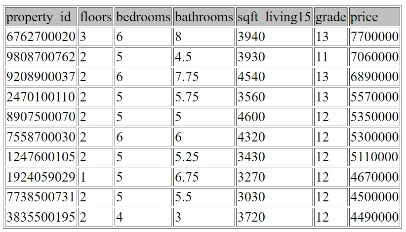

- El precio promedio de las propiedades

- El precio promedio de las propiedades en función a la cantidad de dormitorio

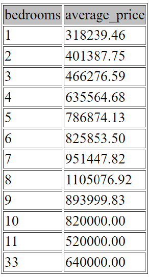

- El precio promedio de las propiedades en función a la cantidad de baños

- El precio promedio de las propiedades en función a la cantidad grado de conservación. 

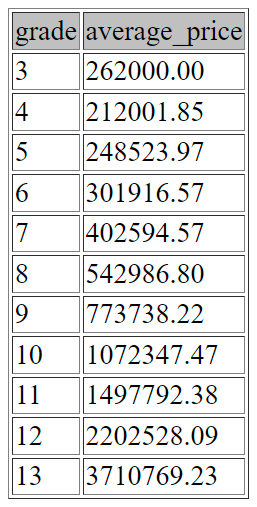

- El precio promedio de las propiedades en función las plantas. 

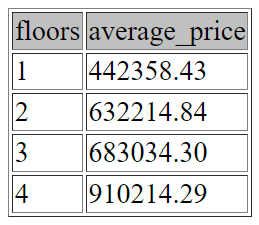

Luego de ello procedí a realizar un análisis mas profundo utilizando Python junto con la libreria de Pandas, Nunpy, Matplolib.

### Modelo 1

- Aqui analicé el tamaño del Dataset, el tipo de columnas contenidas, la existencia de nulos. He visto que tiene una columna de tipo fecha (DataTime) por lo que decidí extraer en columnas el Mes y el Año de la transacción para luego eliminarla.
- Extraje la cantidad de inmuebles en función a los dormitorios y baño con esto no solo vemos segmentada la Base de Datos si no tambien su composición en dos caracteristicas claves para determinar el valor de una propiedad.
- Avanzado en la exploración he detectado de que el DataSet proporcionado es el historial de ventas, por lo pronto selecciono los Ids duplicados (Propiedades que tuvieron una frecuencia de comercialización > 1). Para que el análisis no se encuentre distoricionado procedo a eliminar las transferencias mas antiguas con el fin de poder tener el precio mas actualizado de la propiedad.
- Realizo un describe de la variables numericas con el objetivo de poder identificar:
- La cantidad de datos contenidos
- El promedio 
- La desviación Estandar
- El rango así como tambien los rangos intercuartilicos.

Para conocer la correlaccion existente entre las distintas variable ejecuto un matriz de correlación con mapa de calor donde las correlaciones mas altas son de color rojo y las mas bajas de color azul.

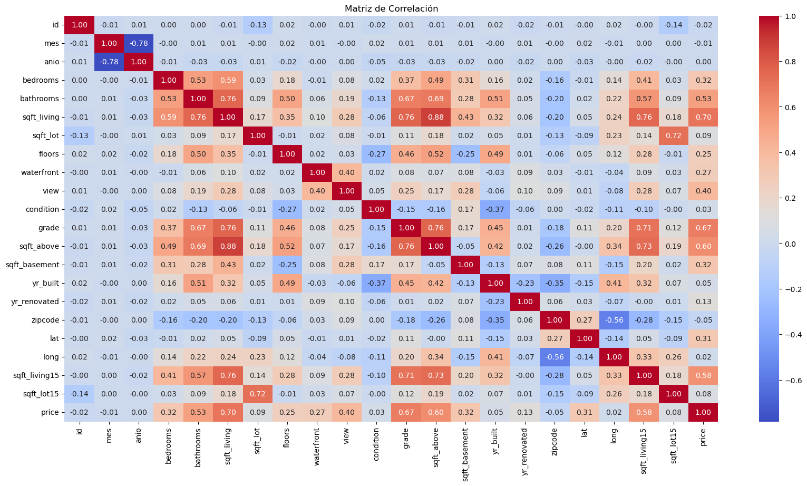

Con el fin de tener una primera aproximación modelizó con los datos sin tratar, para ello utilizo cuatro modelos distintos:

1. OLS: método estadístico utilizado en análisis de regresión para encontrar la mejor línea de ajuste a un conjunto de datos. El objetivo es minimizar la suma de los cuadrados de las diferencias entre los valores reales y los valores predichos.

2. Regresión Lineal: modelo predictivo que busca establecer una relación lineal entre una variable dependiente y una o más variables independientes. La idea es encontrar una ecuación de una línea recta que mejor se ajuste a los datos y permita hacer predicciones sobre la variable dependiente basándose en los valores de las variables independientes.

3. KNN es un algoritmo de aprendizaje automático supervisado que se utiliza tanto para clasificación como para regresión. Funciona asignando etiquetas o estimando valores a un punto de datos basándose en las etiquetas o valores de sus vecinos más cercanos. "K" se refiere al número de vecinos más cercanos que se toman en cuenta para tomar una decisión.

4. MLP es un tipo de red neuronal artificial que consta de múltiples capas de neuronas interconectadas. Cada neurona en una capa está conectada con las neuronas de la capa anterior y de la siguiente.

Vemos que modelo que más se ajusta al tipo de datos que tenemos es la Regresión Lineal utilizando como indicadores el R2, R2 Ajustado, MSE, RMSE. 

- Test size: 0.4, MSE: 41197509637.49109
- Test size: 0.4, RMSE: 202971.69664140636
- Test size: 0.4, R2: 0.7037335231129201
- Test size: 0.4, Adjusted R2: 0.7029707539506597

Luego de esto ya con la información proporcionada por la Matriz de Correlación vemos que existe una correlación significativa con las siguientes variables 'sqft_living' con 'sqft_living15' (0.76) y 'sqft_lot' con 'sqft_lot15' (0.72), vemos que tambien existe una correlación fuerte entre 'sqft_living' y 'sqdt_above' pero como vamos a eliminar 'sqft_living' esto cambiará. Luego de analizados los datos sabemos que el dataframe esta acotado a dos años por lo que tambien elimino la variable año ya que no inside en el análisis.
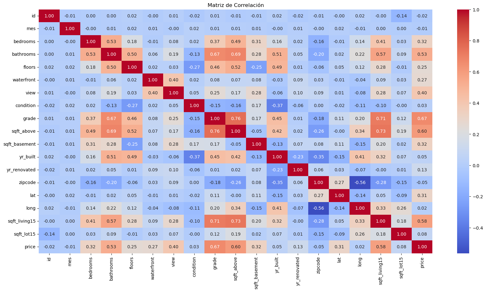

Al contar con el Zipcode elimino las variables espaciales de Latitud y Longitud.

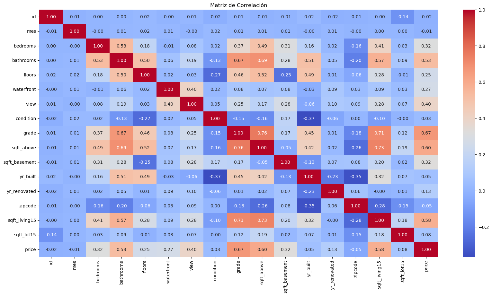

Vemos que la Matriz de Correlación mejora dando valores menos significativos.

### Modelo 2

Aplicamos nuevamente los modelos propuestos y observamos una disminución los indicadores:

- Test size: 0.4, MSE: 47817741730.0548
- Test size: 0.4, RMSE: 218672.68171871584
- Test size: 0.4, R2: 0.6561249939688736
- Test size: 0.4, Adjusted R2: 0.6554412658867064 

Dismunuyendo el R2, R2 Ajustado y aumentado la varianza y la desviación estandar por lo que considero desechar el mismo. Vemos que eliminar variables con correlaciones significativas entre ellas no reflejan una mejora en los modelos, todo lo contrario fue contraproducente ya que el modelo perdió fidelidad.

### Modelo 3

Con el objetivo de construir el modelo mas representativo volvemos al DataFrame previo sin eliminar columnas, para el analisis de las variables ahora utilizamos la tecnica Factor de Inflacion de la Varianza. Es una medida utilizada en análisis de regresión para evaluar la multicolinealidad entre las variables independientes. La multicolinealidad ocurre cuando dos o más variables independientes están altamente correlacionadas entre sí, lo que puede afectar negativamente el rendimiento y la interpretación del modelo de regresión.

Por lo cual elminamos la variable mas significativo 'sqft_above', 'sqft_living' (por su correlatividad alta con algunas variables), 'id' y 'anio' porque no aportan valor al análisis.

Los resultado aplicados continuan sin dar indicadores relevante:

- Test size: 0.4, MSE: 46608337599.98439
- Test size: 0.4, RMSE: 215889.6421785547
- Test size: 0.4, R2: 0.664822264845232
- Test size: 0.4, Adjusted R2: 0.6641165449677275

Hemos observado que eliminar variables con correlaciones significativas entre ellas no ha resultado en una mejora en los modelos; por el contrario, ha sido contraproducente, ya que el rendimiento del modelo se ha visto afectado negativamente.

El siguiente paso en nuestro análisis es utilizar el **VIF** (Factor de Inflación de la Varianza), una medida fundamental en el análisis de regresión para evaluar la multicolinealidad entre las variables independientes.

El VIF nos proporcionará información acerca de la magnitud de la multicolinealidad presente en cada variable. Cuando el VIF de una variable es alto (por encima de cierto umbral, como 5 o 10), indica una fuerte correlación con otras variables, lo que podría afectar negativamente la estabilidad y precisión del modelo.

Para llevar a cabo este análisis, volveremos al DataFrame original df y realizaremos una copia de los datos para trabajar en ella sin modificar los datos originales. Al obtener los valores del VIF para cada variable, podremos identificar aquellas con alta multicolinealidad y tomar decisiones informadas, como la eliminación o transformación de características, con el fin de mejorar la calidad del modelo.

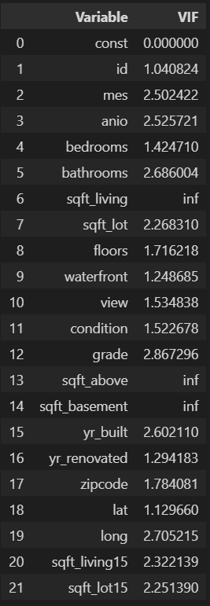

Observamos que 'sqft_above' y'sqft_living' son las que tiene mayor magnitud de multicolinealidad es por ello que las eliminaremos junto con 'id' (ya que es una variable que no aporta valor unicamente identifica el inmueble) y año que al igual id no aportan valor porque tenemos un DataFrame acotado a un periodo muy corto (2 años).

Resulta en un valor "inf" o infinito, significa que hay una alta multicolinealidad entre la variable en cuestión y al menos una de las otras variables independientes en el modelo. La multicolinealidad ocurre cuando dos o más variables independientes están altamente correlacionadas entre sí. Procedemos a eliminar 'sqft_living', 'id', 'anio', 'sqft_above'

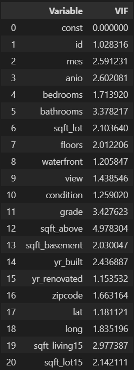

### Modelo 4

Aplicamos nuevamente los modelos propuestos y observamos nuevamente una disminución los indicadores:

- Test size: 0.4, MSE: 46608337599.98439
- Test size: 0.4, RMSE: 215889.6421785547
- Test size: 0.4, R2: 0.664822264845232
- Test size: 0.4, Adjusted R2: 0.6641165449677275

Con el fin de obtener un modelo más optimo realizamos un tratamiento de los Outliers, observamos que la mayoría de los datos no siguen una distribución normal y, al utilizar el gráfico de caja (boxplot), es evidente que algunas variables presentan numerosos valores atípicos (outliers).

Aplicamos primer el tratamiento para nuestra variable objetivo 'price' y como la cantidad de valores fuera de los rangos intercuartilicos procedemos a eliminar esas filas. 

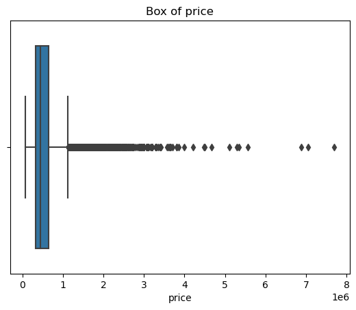

### Modelo 5

Aplicamos nuevamente los modelos propuestos y observamos nuevamente una mejora los indicadores:

- Test size: 0.4, MSE: 14092875118.329184
- Test size: 0.4, RMSE: 118713.41591551134
- Test size: 0.4, R2: 0.6715789497581944
- Test size: 0.4, Adjusted R2: 0.6708480423763507

Volvemos a a realizar los histogramas y los graficos de cajas y decidimos realizar el mismo tratamiento para las variables mas significativas ('bedrooms', 'bathrooms', 'sqft_lot', 'condition', 'grade', 'long', 'sqft_lot15')

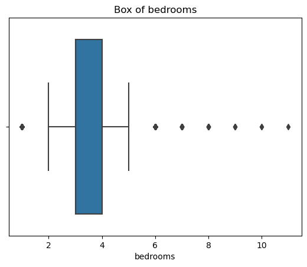

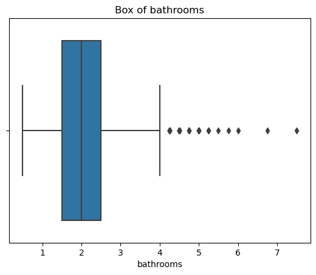

Procedemos a eliminar los outliers

### Modelo 6

Aplicamos nuevamente los modelos propuestos y observamos nuevamente una mejora los indicadores:

- Test size: 0.4, MSE: 12686106903.603832
- Test size: 0.4, RMSE: 112632.61918114056
- Test size: 0.4, R2: 0.7010952551501182
- Test size: 0.4, Adjusted R2: 0.6999852313400712

Como podemos ver el MSE y el RMSE son muy alto por lo que procedemos a escalar el DataFrame por un lado y a normalizarlo por otro para luego aplicar los modelos propuestos.

### Modelo 6 - Escalado

Aplicamos los modelos propuestos al DataFrame escalado y observamos nuevamente una mejora los indicadores:

- Test size: 0.4, MSE: 0.30850561789329917
- Test size: 0.4, RMSE: 0.5554328203242037
- Test size: 0.4, R2: 0.7010952551501195
- Test size: 0.4, Adjusted R2: 0.6999852313400725

### Modelo 6 - Normalizado

Aplicamos los modelos propuestos al DataFrame normalizado y observamos valores similares pero con mejora algunos de los indicadores:

- Test size: 0.4, MSE: 0.011684037142144865
- Test size: 0.4, RMSE: 0.10809272474197727
- Test size: 0.4, R2: 0.7010952551501195
- Test size: 0.4, Adjusted R2: 0.6999852313400725

### Conclusión
Luego de eliminar los outliers, observamos una mejora significativa en el coeficiente R2 del modelo. Al aplicar las técnicas de escalado y normalización para reducir la desviación estándar y la varianza, notamos una optimización más efectiva. 

Ambos modelos muestran un rendimiento similar, con un R-squared y Adjusted R-squared de aproximadamente 70.3%, lo que indica que alrededor del 70% de la variabilidad en el precio se explica mediante las variables consideradas.

Sin embargo, al examinar más detenidamente los modelos, notamos algunas diferencias importantes. El **Modelo 6 - Escalado** tiene coeficientes muy pequeños y no significativos para algunas variables, mientras que el **Modelo 6 - Normalizado** muestra coeficientes más significativos y fáciles de interpretar.

Además, al evaluar la precisión de las predicciones, observamos que el **Modelo 6 - Normalizado**  tiene un Mean Squared Error (MSE) y un Root Mean Squared Error (RMSE) más bajos. Esto indica que las predicciones del modelo tienen un menor error en promedio y son más cercanas a los valores reales de los precios de las viviendas.

Por lo tanto, con base en la interpretación de los coeficientes y las métricas de evaluación, podemos concluir que el modelo es más adecuado para nuestro proyecto. Ofrece resultados más interpretables y precisos, lo que lo convierte en una opción preferible para predecir los precios de las viviendas en nuestro análisis. Con este modelo seleccionado, esperamos tomar decisiones informadas y obtener una mejor comprensión del mercado inmobiliario.

Con estos avances, reforzamos la importancia del preprocesamiento adecuado de los datos y cómo este proceso puede impactar significativamente en el rendimiento y precisión del modelo de regresión. Debemos seguir trabajando en el mejoramiento del modelo.

Como parte del proceso de analisis he trabajando con la herramienta de Business Inteligent Tableau. Para ello he realizado distintos graficos con el fin de poder interpretar mejor las caracteristicas de las propiedades.

**Distribucion geografica de los inmuebles de mayor valor**

En la primera visualización, representé la distribución geográfica de los inmuebles de mayor valor en un mapa.

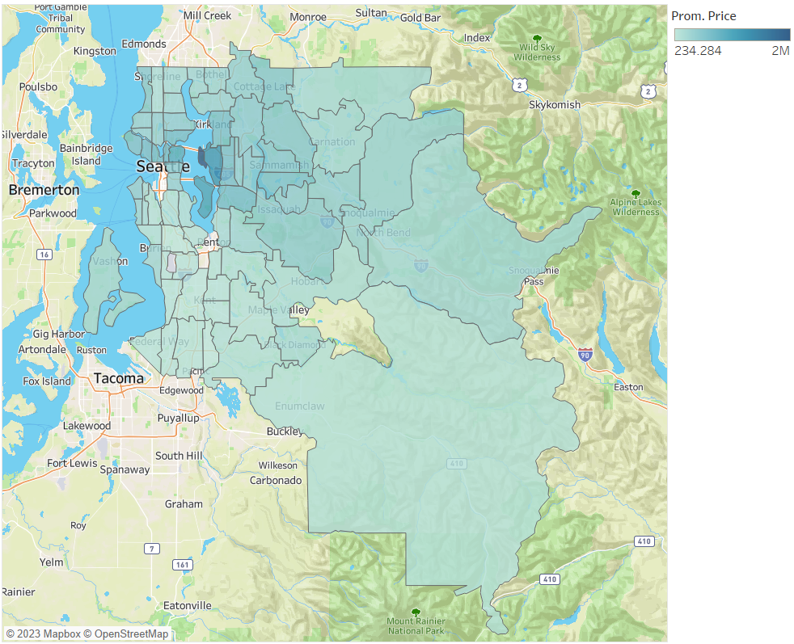

 Se puede observar que la zona central concentra la mayor cantidad de inmuebles con valores promedio más altos.

**Evolución de las ventas y cantidad de operaciones**

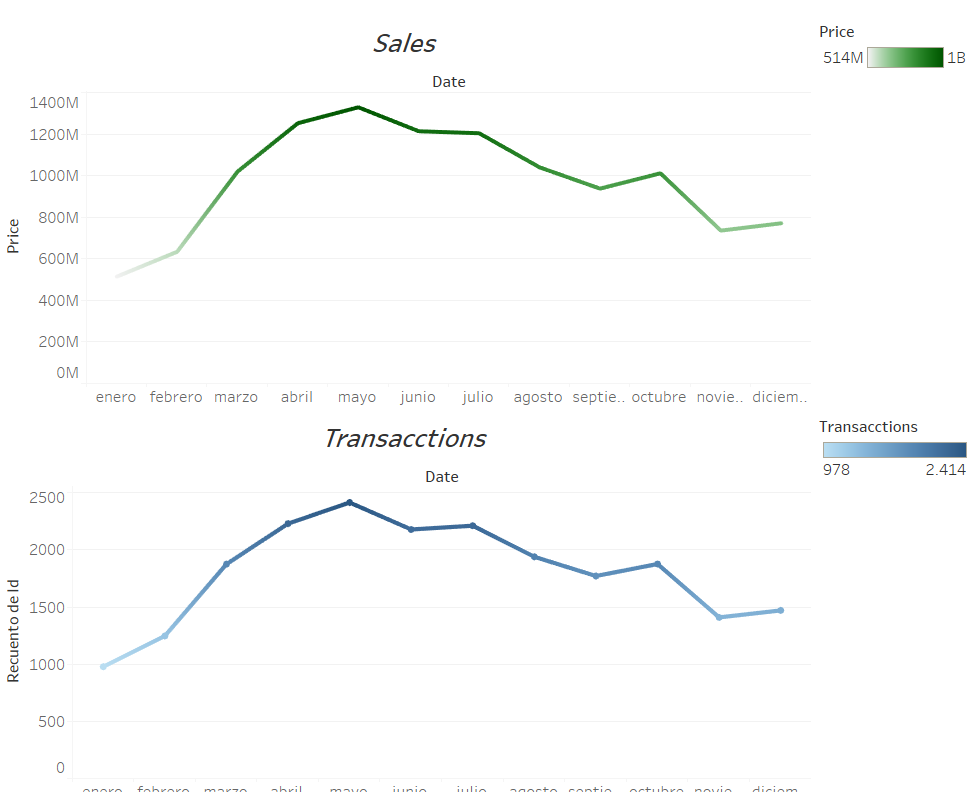

En el segundo gráfico, analicé la evolución de las ventas y la cantidad de operaciones a lo largo del tiempo. Descubrí que los meses con mayor actividad son los previos al verano, específicamente de abril a julio, donde no solo se realizan la mayoría de las transacciones, sino que también se alcanzan los valores promedio de ventas más altos.

**Valor promedio de los inmuebles en base al año de contrucción y el precio promedio por cantidad de plantas**

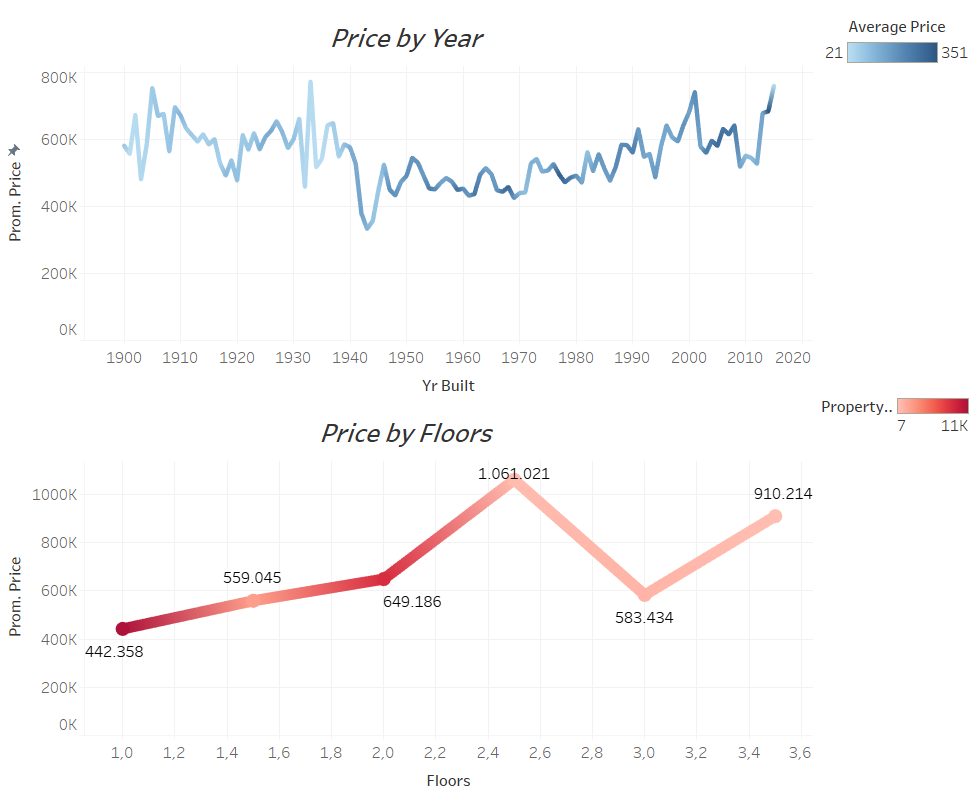

El tercer gráfico muestra el valor promedio de los inmuebles en función del año de construcción, y también el precio promedio según la cantidad de plantas. Es interesante notar que el año 1933 muestra el precio promedio más alto de las viviendas, lo que sugiere que no siempre las propiedades más recientes son las mejor valoradas.

Del mismo modo, en el caso del número de plantas, se destaca que las propiedades con 2.5 plantas muestran un valor promedio superior al resto. Sería relevante analizar estas propiedades en detalle para comprender las características que las hacen sobresalir.

**Valor promedio de los inmuebles en base a la cantidad de habitaciones y el precio promedio por cantidad de baños**

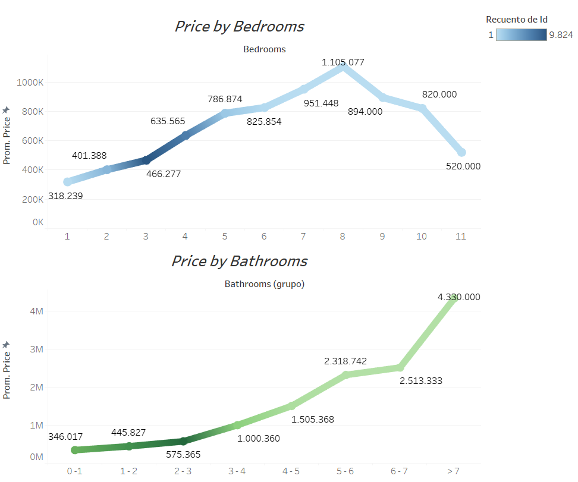

En el último gráfico, exploré el valor promedio de los inmuebles en función de la cantidad de habitaciones, así como el precio promedio según la cantidad de baños. Se destaca que las propiedades con 8 dormitorios son las mejor valoradas, con un promedio muy por encima de la media.

En el caso de los baños, se observa una tendencia positiva, donde un mayor número de baños se asocia con un precio promedio más alto.

Estas visualizaciones me han permitido obtener una comprensión más profunda de las características que influyen en el valor de los inmuebles de mayor precio. Además, han resaltado la importancia de considerar diversos factores, como la ubicación, el año de construcción, la cantidad de plantas, dormitorios y baños, para entender mejor el mercado inmobiliario y tomar decisiones informadas.